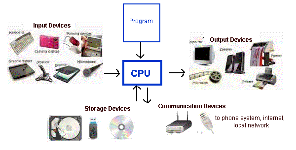

..  Copyright (C)  Brad Miller, David Ranum, Jeffrey Elkner, Peter Wentworth, Allen B. Downey, Chris
    Meyers, and Dario Mitchell.  Permission is granted to copy, distribute
    and/or modify this document under the terms of the GNU Free Documentation
    License, Version 1.3 or any later version published by the Free Software
    Foundation; with Invariant Sections being Forward, Prefaces, and
    Contributor List, no Front-Cover Texts, and no Back-Cover Texts.  A copy of
    the license is included in the section entitled "GNU Free Documentation
    License".

.. |NOTE| image:: Figures/pencil.png

.. role:: notetext

.. raw:: html

    
    
.. qnum::
   :prefix: lps-gi-ocp-
   :start: 1

Overview - Computers and Programs 
-----------------------------------------

As you know, there are computers everywhere.  For this course, we are going to concentrate on the thing you are looking at now, your desktop, laptop or pad computer.  Most of what we will learn about it will apply to many other computers, but we will focus on this to keep things (relatively) simple. 

A computer is an electronic device that takes various kinds of **input**, **processes** it, and generates various kinds of **output**.  What could be simpler?  Well, let's explain it a little more.

**Processing**
  At the heart of the computer is a chip called the |NOTE| :notetext:`Central Processing Unit (CPU) .  The CPU reads and executes a set of instructions called a program`.  These instructions tell the CPU how to perform a desired task.  In order to accomplish the task, the computer will need fetch all kinds of information (data), from different inputs, like a keyboard or a mouse.  It manipulates the data, and then generates output, like images  on a screen, or sound from a speaker. 

**Input Devices**
 |NOTE| :notetext:`Input is information or data going into the processor from the user or another computer.`  Some of the devices that can generate input are keyboards, mice, touchpads, microphones, scanners, communication devices, and  storage devices.

**Output Devices**
 |NOTE| :notetext:`Output is data that the computer has created, and sends out to the world: to users, to storage and to other computers.` It does so through output devices such as screens, headphones, printers, storage devices and communication devices.

**Storage Devices**

|NOTE| :notetext:`Storage devices hold permanent copies of the electronic data` that computers use.  Some examples of storage devices are hard discs, thumb drives, CDs and DVDs. The data held on these devices can be movies, songs, documents, programs, and many other kinds computer files.  

**Communication Devices**

|NOTE| :notetext:`Communication Devices allow computer to send information to and from one another.` Examples of these component are  WiFi routers, modes and network connectors.  They send and receive messages, which allow your computer to talk to the computer on the next desk, through a local network, or to computers all over the world, through the internet.

|
   **Figure 1.  This diagram shows a CPU and some of the different types of devices with which it inputs and outputs data.**

   

|
|
|

**Check your understanding**

.. dragndrop:: lps-gi-ocp-dd-1
    :feedback: This is feedback.
    :match_1: DVD|||Storage
    :match_2: Mouse|||Input
    :match_3: Touch Screen|||Input and Output
    :match_4: Headphones|||Output
    :match_5: WiFi|||Communications

    Match the Device to its type.

.. index:: input,output,processing,CPU,storage

