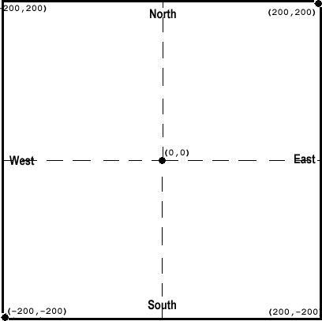

..  Copyright (C)  Brad Miller, David Ranum, Jeffrey Elkner, Peter Wentworth, Allen B. Downey, Chris
    Meyers, and Dario Mitchell.  Permission is granted to copy, distribute
    and/or modify this document under the terms of the GNU Free Documentation
    License, Version 1.3 or any later version published by the Free Software
    Foundation; with Invariant Sections being Forward, Prefaces, and
    Contributor List, no Front-Cover Texts, and no Back-Cover Texts.  A copy of
    the license is included in the section entitled "GNU Free Documentation
    License".

.. |NOTE| image:: Figures/pencil.png

.. role:: notetext

.. raw:: html

    

.. role:: sctnhead

.. raw:: html

    
    

.. qnum::
   :prefix: lps-ct-
   :start: 1

3. Controlling Turtles
------------------------

:sctnhead:`Objects`

We have used the word ``object`` several to describe turtles.  Objects are an important concept in programming.  We will not go into much detail now, except the to say that |NOTE| :notetext:`Objects are things that can hold both values (like strings and numbers), and perform behaviors (like drawing, moving, doing complex math, making sounds, etc.)`.  We will define objects more formally after we have used them for a while.

So far, we have learned about only one object, the ``Turtle``.  But we have actual used another object, the ``Screen``.  The Screen is the window in which the turtle moves.  We created a Screen named "wn" (short for "window") in the second line of our python turtle code:

   .. code-block:: python

    import turtle               # allows us to use the turtles library
    wn = turtle.Screen()        # creates a graphics window
    alex = turtle.Turtle()      # create a turtle named alex

:sctnhead:`The Screen`

We saw that the turtle has **methods** we can use to make it do things.  The screen also has methods of its own.  For now we are only going to talk about two methods

=========== ======= =============== ============== =================================================================================   
        Screen Methods
------------------------------------------------------------------------------------------------------------------------------------   
Method      Short   Parameters       Examples      Notes 
            name
=========== ======= =============== ============== =================================================================================   
bgcolor             name            bgcolor("red")  Set background color to a name, using the same names as turtle method color.
bgcolor             r,g,b           bgcolor(1,5,9)  Set background color to a name, using the same values as turtle method color. green and blue.
exitonclick                         exitonclick()   Close the program, shutting the window, if user clicks on the screen.
=========== ======= =============== ============== =================================================================================   

The code below is like code in the previous lesson, but it invokes the two screen methods.

.. activecode:: lps_ct_code1
    :nocodelens:
    :above:

    import turtle               # allows us to use the turtles library
    wn = turtle.Screen()        # creates a graphics window
    wn.bgcolor( "darkred" )
    wn.exitonclick()
    alex = turtle.Turtle()      # create a turtle named alex
    alex.forward(150)           # tell alex to move forward by 150 units
    alex.left(90)               # turn by 90 degrees
    alex.forward(75)            # complete the second side of a rectangle

**Things to notice**

- Line 2 creates the screen object wn.

- Lines 3 and 4 invoke methods of wn.

- Line 5 creates the turtle object alex

**Screen Layout**

The screen created in this environment is 400 pixels wide and 400 pixels high.  The origin (0,0) is at the center of the screen, so the bottom-left corner is at (-200,-200), and the top-right corner is at (200,200).

Notice also that  the directions on the screen are labeled ``north, south, east`` and ``west``.

|LAYOUT|

You can move the turtle using these coordinates, and the methods listed below. 

=========== ======= =============== ============= =================================================================================   
        More Turtle Methods
-----------------------------------------------------------------------------------------------------------------------------------   
Method      Short   Parameters       Examples      Notes 
            name
=========== ======= =============== ============= =================================================================================   
setpos      goto()  x,y             setpos(10,40) Move turtle to coordinate (x,y).
setx                x               setx(-90)     Move turtle to coordinate with new x value, leaving y the same.
sety                y               sety(23)      Move turtle to coordinate with new y value, leaving x the same.
=========== ======= =============== ============= =================================================================================   

**Exercise 1.**

Let's use the turtle coordinate methods to draw a square.  Add some steps to finish the square.  Save the code when your are done.

.. activecode:: lps_ct_code1
    :above:

    import turtle               # allows us to use the turtles library
    wn = turtle.Screen()        # creates a graphics window
    myrtle = turtle.Turtle()    # create a turtle named stairs
         # start by going to the upper right
    myrtle.penup()              # don't draw when you move to first position.
    myrtle.setpos( -150, 150 )
    myrtle.pendown()            # start drawing.
    myrtle.setx( 150 )               
    myrtle.sety( -150 )  
                                ## add code to finish the square.
    wn.exitonclick()

**Exercise 2.**

.. mchoice:: lps_ct_q2
   :answer_a: North
   :answer_b: South
   :answer_c: East 
   :answer_d: West
   :correct: c
   :feedback_a: Some turtle systems start with the turtle facing north, but not this one.
   :feedback_b: No, look at the first example with a turtle.  Which direction does the turtle move?
   :feedback_c: Yes, the turtle starts out facing east.
   :feedback_d: No, look at the first example with a turtle.  Which direction does the turtle move?

   Which direction does the Turtle face when it is created?

**Exercise 3.**  A Mixed up program

.. parsonsprob:: lps_ct_q3

   The following program uses a turtle to draw a capital L as shown in the picture to the left of this text,  but the lines are mixed up.  The program should do all necessary set-up: 
   
   - import the turtle module, 
   - get the window to draw on, and 
   - create the turtle.  Remember that the turtle starts off facing east when it is created.  The turtle should turn to face south and draw a line that is 150 pixels long and then turn to face east and draw a line that is 75 pixels long.  We have added a compass to the picture to indicate the directions north, south, west, and east.    
Drag the blocks of statements from the left column to the right column and put them in the right order.  Then click on <i>Check Me</i> to see if you are right. You will be told if any of the lines are in the wrong order.

   -----
   import turtle
   window = turtle.Screen()
   ella = turtle.Turtle()
   =====
   ella.right(90)
   ella.forward(150)
   =====
   ella.left(90)
   ella.forward(75)

**Exercise 4.**

.. parsonsprob:: lps_ct_q4

   The following program uses a turtle to draw a checkmark as shown to the left,  but the lines are mixed up.  The program should do all necessary set-up: import the turtle module, get the window to draw on, and create the turtle.  The turtle should turn to face southeast, draw a line that is 75 pixels long, then turn to face northeast, and draw a line that is 150 pixels long.  We have added a compass to the picture to indicate the directions north, south, west, and east.  Northeast is between north and east. Southeast is between south and east.   
Drag the blocks of statements from the left column to the right column and put them in the right order.  Then click on <i>Check Me</i> to see if you are right. You will be told if any of the lines are in the wrong order.

   -----
   import turtle
   window = turtle.Screen()
   =====
   maria = turtle.Turtle()
   =====
   maria.right(45)
   maria.forward(75)
   =====
   maria.left(90)
   maria.forward(150)

**Exercise 5.**

.. parsonsprob:: lps_ct_q5

   The following program uses a turtle to draw a single line to the west as shown to the left,  but the program lines are mixed up.  The program should do all necessary set-up: import the turtle module, get the window to draw on, and create the turtle.  The turtle should then turn to face west and draw a line that is 75 pixels long.  
Drag the blocks of statements from the left column to the right column and put them in the right order.  Then click on <i>Check Me</i> to see if you are right. You will be told if any of the lines are in the wrong order.
   
   -----
   import turtle
   window = turtle.Screen()
   jamal = turtle.Turtle()
   jamal.left(180)
   jamal.forward(75)

**Exercise 6.**

   True or False: A Turtle object can have any name that follows the naming rules found in Unit 1.

.. mchoice:: lps_ct_q6
   :answer_a: 
   :answer_b: 
   :answer_c: 
   :answer_d: 
   :answer_e: 
   :correct: e
   :feedback_a: This code would turn the turtle to the south before drawing
   :feedback_b: This code would turn the turtle to the west before drawing
   :feedback_c: This code would turn the turtle to the south before drawing
   :feedback_d: This code is almost correct, but the short end would be facing east instead of west.  
   :feedback_e: Yes, the turtle starts facing east, so to turn it north you can turn left 90 or right 270 degrees.

   Which of the following code snippets would produce the following image? 

   .. image:: ../../_static/turtleTest1.png 
      :alt: long line to north with shorter line to west on top

**Exercise 7.**

.. parsonsprob:: lps_ct_q7

   The following program uses a turtle to draw a capital L in white on a blue background as shown to the left,  but the lines are mixed up.  The program should do all necessary set-up and create the turtle and set the pen size to 10.  The turtle should then turn to face south, draw a line that is 150 pixels long, turn to face east, and draw a line that is 75 pixels long.   Finally, set the window to close when the user clicks in it.  
Drag the blocks of statements from the left column to the right column and put them in the right order.  Then click on <i>Check Me</i> to see if you are right. You will be told if any of the lines are in the wrong order.

   -----
   import turtle
   wn = turtle.Screen()
   =====
   wn.bgcolor("blue")       
   jamal = turtle.Turtle()
   =====
   jamal.color("white")                 
   jamal.pensize(10) 
   =====                
   jamal.right(90)
   jamal.forward(150)
   ===== 
   jamal.left(90)
   jamal.forward(75)
   wn.exitonclick()

**Exercise 8.**

.. parsonsprob:: lps_ct_q8

   The following program uses a turtle to draw a capital T in white on a green background as shown to the left,  but the lines are mixed up.  The program should do all necessary set-up, create the turtle, and set the pen size to 10.  After that the turtle should turn to face north, draw a line that is 150 pixels long, turn to face west, and draw a line that is 50 pixels long.  Next, the turtle should turn 180 degrees and draw a line that is 100 pixels long.  Finally, set the window to close when the user clicks in it.  
Drag the blocks of statements from the left column to the right column and put them in the right order.  Then click on <i>Check Me</i> to see if you are right. You will be told if any of the lines are in the wrong order.
  
   -----
   import turtle
   wn = turtle.Screen()
   wn.bgcolor("green")      
   jamal = turtle.Turtle()
   jamal.color("white")                 
   jamal.pensize(10) 
   =====                
   jamal.left(90)
   jamal.forward(150)
   =====
   jamal.left(90)
   jamal.forward(50)
   =====
   jamal.right(180)
   jamal.forward(100)
   =====
   wn.exitonclick()

:sctnhead:`Play Ground`

.. activecode:: lps_ct_code_play
    :above:

    import turtle               # allows us to use the turtles library
    wn = turtle.Screen()        # creates a graphics window
    wn.exitonclick()
    myrtle = turtle.Turtle()    # create a turtle named stairs

.. index:: object, module
|
|
|

:sctnhead:`Glossary and Terms`

object
    Something that can hold both values (like strings and numbers), and perform behaviors (like drawing, moving, performing complex math, make sounds) 
    
Screen
    The object that is the window that turtle objects draw on.
