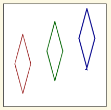

..  Copyright (C)  Brad Miller, David Ranum, Jeffrey Elkner, Peter Wentworth, Allen B. Downey, Chris
    Meyers, and Dario Mitchell.  Permission is granted to copy, distribute
    and/or modify this document under the terms of the GNU Free Documentation
    License, Version 1.3 or any later version published by the Free Software
    Foundation; with Invariant Sections being Forward, Prefaces, and
    Contributor List, no Front-Cover Texts, and no Back-Cover Texts.  A copy of
    the license is included in the section entitled "GNU Free Documentation
    License".

.. |NOTE| image:: Figures/pencil.png

.. role:: notetext

.. raw:: html

    

.. role:: sctnhead

.. raw:: html

    
    
.. qnum::
   :prefix: lps_u2lab-
   :start: 1

Unit 2 Lab
==================

Warm ups
-----------------

:sctnhead:`Basic Turtles`

**Warm up 1.**

.. parsonsprob:: lps_u2lab-warm1-par

    The following program uses a turtle to draw a checkmark as shown to the left,  but the lines are mixed up.  The program should do all necessary set-up: import the turtle module, get the window to draw on, and create the turtle.  The turtle should turn to face northwest, draw a line that is 75 pixels long, then turn to face southwest, and draw a line that is 150 pixels long.     
Drag the blocks of statements from the left column to the right column and put them in the right order.  Then click on <i>Check Me</i> to see if you are right. You will be told if any of the lines are in the wrong order.

    -----
    import turtle
    window = turtle.Screen()
    maria = turtle.Turtle()
    maria.left(135)
    maria.forward(75)
    maria.left(90)
    maria.forward(150)

**Warm up 2.**

A pentagon has an internal angle of 108 degrees.  Draw a pentagon with a side of length 75.
Remember, for the shape to have an internal angle of 108 degrees, the turtle must turn (180 - 108) degrees.

.. activecode:: lps_u2lab_warm1_code
    :nocodelens:
    :above:

    import turtle               # allows us to use the turtles library
    wn = turtle.Screen()        # creates a graphics window
    t = turtle.Turtle()         # create a turtle named t

    ## draw a pentagon. 
    

Drawing Problems
---------------------

**Exercise 1. Three Squares**

Draw three squares, next to each other.  Make each side 100.  The squares shouldn't touch.

Tips:
    - Use the comments already present as a guide to the different sections of the code.
    - Use goto() to locate your turtle before drawing each square.
    - Use penup() before locating the turtle, and pendown() after.
    - Start your first square near the left side of the screen.  
    - Remember the screen coordinates go from (-200,-200) to (200,200)
    - Get your first square working properly before going on to draw the other two.
    - Use a variable for the length of the side, rather than typing 100 over and over again.
    
.. activecode:: lps_u2lab_code1
    :nocodelens:
    :above:

    # SET UP 
    import turtle           
    wn = turtle.Screen()    
    t = turtle.Turtle()    # create a turtle named t
    side = 100

    ## FIRST SQUARE
        ## locate turtle
    t.penup()
    t.goto( ???, ??? )
    t.pendown()
    
        ## draw the square

    ## SECOND SQUARE
        ## locate turtle 

        ## draw the square

    ## THIRD SQUARE
        ## locate turtle 

        ## draw the square

**Exercise 2. Three Diamonds**

Draw three diamonds, next to each other.  The diamonds shouldn't touch. 

Tips:
    - A diamond is a square drawn at an angle. Turn the turtle to an angle before drawing the square.
    -  The turtle will have to turn alot to get ready to start the diamond, about (90 degrees minus (the small internal angle / 2) ).
    - Get your first diamond working properly before going on to draw the other two.
    - Want to draw faster? Use t.speed(10), or even faster t.speed(50).
    
.. activecode:: lps_u2lab_code2
    :nocodelens:
    :above:
    
    # SET UP 
    import turtle           
    wn = turtle.Screen()    
    t = turtle.Turtle()    # create a turtle named t
    
    ## FIRST DIAMOND
        ## locate turtle, and turn it to diamond drawing angle.
    
        ## draw the diamond
    
    
    ## SECOND DIAMOND
        ## locate turtle 
    
        ## draw the diamond
    
    
    ## THIRD DIAMOND
        ## locate turtle 
    
        ## draw the diamond

..

**Exercise 3. Fancy Diamonds**

Draw three tall, thin diamonds, next to each other.  The diamonds shouldn't touch. Make them each different colors, different heights on the screen, and different line thickness.

Tips:
    - Because the diamond is taller, you should start with lower values of y when locating the turtle.
    - You can no longer draw a square.  There are two different angles in the shape.  We suggest one inner angle of 30, and the other 150 degrees.
    - Get your first diamond working properly before going on to draw the other two.
    
.. activecode:: lps_u2lab_code3
    :nocodelens:
    :above:
    
    # SET UP 
    import turtle           
    wn = turtle.Screen()    
    
    
    ## FIRST DIAMOND
        ## locate turtle, and turn it to diamond drawing angle.
    t.penup()
    t.goto( ???, ??? )
    t.pendown()
    
        ## draw the diamond
    
    
    ## SECOND DIAMOND
        ## locate turtle 

        ## draw the diamond

    ## THIRD DIAMOND
        ## locate turtle 

        ## draw the diamond

**Exercise 4. Stairway**

Draw a stairway going down from the top left.  Each step should be 30 long.

Tips:
    - Use a variable to hold the length of the step.
    - The screen is 400 by 400, pick a number of steps that will use alot of the screen, without running off.
    - Use comments to separate the setup section form the stari drawing section of your code.
    
.. activecode:: lps_u2lab_code4
    :nocodelens:
    :above:

    #SET UP
    import turtle           
    wn = turtle.Screen()    

    
    

**Exercise 5. EXTRA CREDIT Faceted Diamond  EXTRA CREDIT**

This diamond's corners are at (0,150), (50,0 ),(0,-150), (-50,0 ).  Draw it with all its facets.

Tips:
    - Use goto() for all your drawing. 
    - Notice the facet lines are thinner than the outline of the diamond.
    - Create some variables for the goto targets on the x-axis.
    
.. activecode:: lps_u2lab_code5
    :nocodelens:
    :above:
    
    # SET UP 
    import turtle           
    wn = turtle.Screen()    
        
|
|
|
|
:sctnhead:`Play Ground`

Draw what you like and save it.  Cool drawings will be shared with the class.

.. activecode:: lps_u2lab_play
    :above:

    import turtle               
    wn = turtle.Screen()        
    wn.exitonclick()
    t = turtle.Turtle()    

.. index:: object, module
|
|

